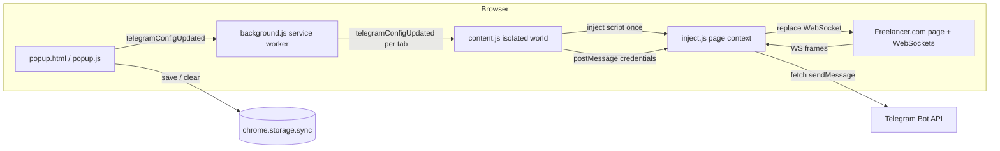

# How the Freelancer Job Alert extension works

This document describes **what runs where**, **how data flows**, and **the logic** behind notifications. It is not a hosted “bot server”: everything runs in **your browser** while you have Freelancer open. Telegram is used only as a **delivery channel** via the official [Telegram Bot API](https://core.telegram.org/bots/api).

---

## 1. What you are actually building

| Piece | Role |
|--------|------|
| **Telegram Bot** (from [@BotFather](https://t.me/BotFather)) | Gives you a **bot token**. The extension calls `api.telegram.org` to send messages **as that bot** to a chat you choose. |
| **Chat ID** | The destination (your user DM with the bot, or a group where the bot was added). |
| **This Chrome extension** | Runs on `https://www.freelancer.com/*`, watches live traffic, and when it recognizes a **new project** event, it asks Telegram to post a message. |

There is **no** separate backend: the browser performs `fetch` to Telegram’s HTTPS API.

---

## 2. High-level architecture

---

## 3. Why there are two scripts on the page (`content.js` vs `inject.js`)

Chrome **content scripts** run in an **isolated world**: they share the DOM with the page but **not** the same JavaScript globals as the page. In particular, they do **not** see the page’s `window.WebSocket` constructor that Freelancer’s own scripts will call.

To observe **all** WebSocket traffic the site creates, the extension must run code in the **page’s world**. That is what `inject.js` does: it is loaded as a `<script src="chrome-extension://…/inject.js">` so it executes with the page’s `window` and can wrap `WebSocket` before the app connects.

`content.js` cannot wrap `WebSocket` reliably; it only **injects** `inject.js` and **passes credentials** into the page via `window.postMessage`.

---

## 4. Credential flow (storage → page)

1. **Popup** (`popup.js`) saves `botToken` and `chatId` in `chrome.storage.sync` (optional sync across signed-in Chrome profiles).
2. After save or clear, the popup sends `chrome.runtime.sendMessage({ type: 'telegramConfigUpdated' })`.
3. **Background** (`background.js`) listens for that message and, using `chrome.tabs.query({ url: 'https://www.freelancer.com/*' })`, sends the same message to each matching tab’s **content script** with `chrome.tabs.sendMessage`.
4. **Content script** (`content.js`) loads credentials from storage and:
   - **First time** on that page load: appends `inject.js`, waits for `onload`, then `postMessage`s `{ type: 'FROM_EXTENSION', credentials: { … } }` to the page.
   - **Later updates** (save again, or clear): does **not** re-insert the script; it only `postMessage`s again so the page updates `TELEGRAM_BOT_TOKEN` / `TELEGRAM_CHAT_ID` without double-wrapping `WebSocket`.

Re-injecting `inject.js` on every config change would run `observeForNotification()` again and risk **nested** `WebSocket` wrappers and duplicate Telegram sends. The code avoids that by injecting **once** per tab life and only updating credentials via `postMessage`.

---

## 5. WebSocket interception logic (`inject.js`)

### 5.1 Patch once

`observeForNotification()` sets `window.__freelancerNotifierWsPatched = true` and replaces `window.WebSocket` with a constructor that:

1. Creates a real socket with the **original** `WebSocket` implementation.
2. Attaches a `message` listener on that socket.

So every WebSocket the page opens goes through this wrapper, but the patch is applied **only once**.

### 5.2 Frame parsing (assumption-heavy)

Freelancer’s real-time channel sends string frames. The handler:

1. Ignores non-string payloads.
2. If the string starts with `'a'`, strips that prefix (legacy framing seen in similar stacks).
3. `JSON.parse(raw)` → expects a **JSON array**; takes `outer[0]` as a string and `JSON.parse`s it again → `data`.
4. If `data.body.type === 'project'`, treats it as a new project notification.
5. Reads `data.body.data.jobString` (or falls back to `"New Project"`) and passes that text to `sendTelegramMessage`.

If Freelancer changes the WebSocket payload shape, this chain may stop matching; errors are caught and ignored so the page keeps working.

### 5.3 Sending to Telegram

`sendTelegramMessage(text)` calls:

`POST https://api.telegram.org/bot<token>/sendMessage`

with JSON `{ chat_id, text }`. If token or chat id is empty (e.g. after clear), it returns without sending.

---

## 6. Popup behavior (`popup.js`)

| Action | Logic |
|--------|--------|
| **Save** | Validates non-empty fields and a **plausible** token shape (`digits:long_secret`). Writes to `chrome.storage.sync`, then notifies background so open Freelancer tabs reload credentials. |
| **Test** | Sends a one-off test message via the same Telegram API from the popup (requires `https://api.telegram.org/*` in the manifest). Does not use WebSockets. |
| **Clear** | Removes keys from storage and notifies tabs so the injected script clears in-memory credentials. |

---

## 7. Operational requirements

- **A Freelancer tab** must be open on `https://www.freelancer.com/…` so the content script runs and `inject.js` can patch WebSockets. Background work alone does not monitor the site.
- **Live project events** must actually arrive over WebSocket on the pages you use (often project search or logged-in areas). If the site does not open a socket or uses a different channel, nothing will match `body.type === 'project'`.
- The README may mention “messages” broadly; the **implemented** path in `inject.js` reacts specifically to **`body.type === 'project'`** frames, not generic inbox messages, unless the same structure is reused elsewhere.

---

## 8. File reference

| File | Responsibility |
|------|----------------|
| `manifest.json` | MV3 entry: permissions, host access, content script on Freelancer, web-accessible `inject.js`, background service worker. |
| `background.js` | Broadcasts `telegramConfigUpdated` to all Freelancer tabs. |
| `content.js` | Injects `inject.js` once; forwards credentials via `postMessage`; listens for tab messages from the background. |
| `inject.js` | Page context: WebSocket wrapper, frame parsing, Telegram `sendMessage`. |
| `popup.html` / `popup.js` | UI, storage, test message, notify-after-save. |

---

## 9. Security notes (short)

- The **bot token** is as sensitive as a password; anyone with it can control the bot. It is stored in `chrome.storage.sync` and only sent to Telegram’s API and into the page context for `inject.js`.
- `postMessage` uses `'*'` as target origin; the page listener checks `event.source === window` to reduce noise from other contexts, but **malicious scripts on the same page** could still interfere in principle. Treat this as a convenience tool for a trusted machine and a bot you control.
